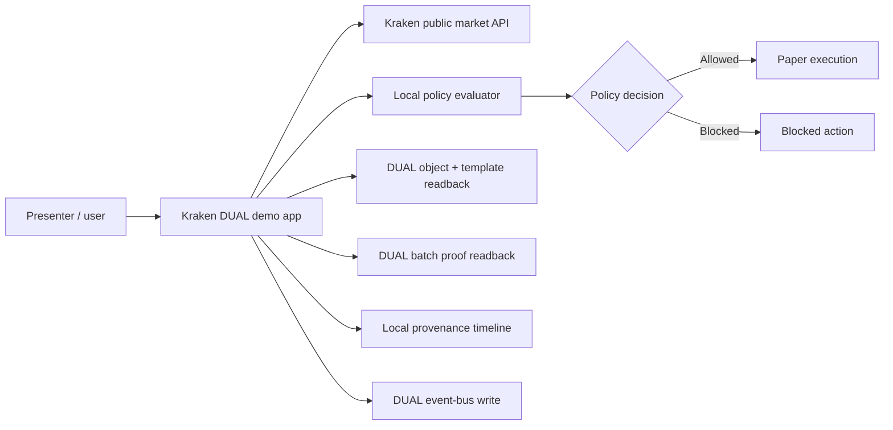
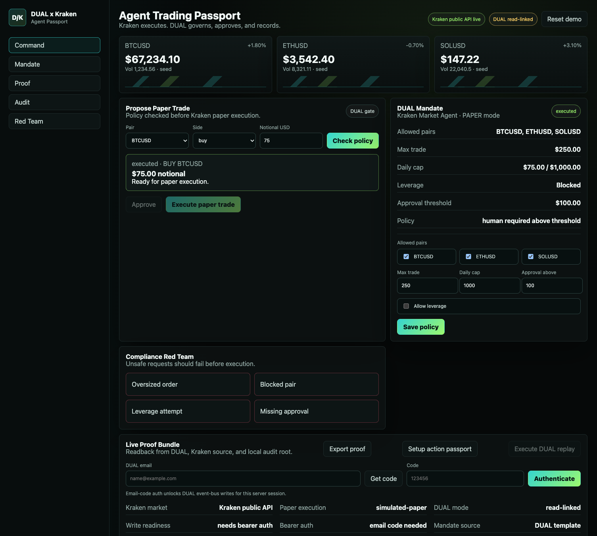
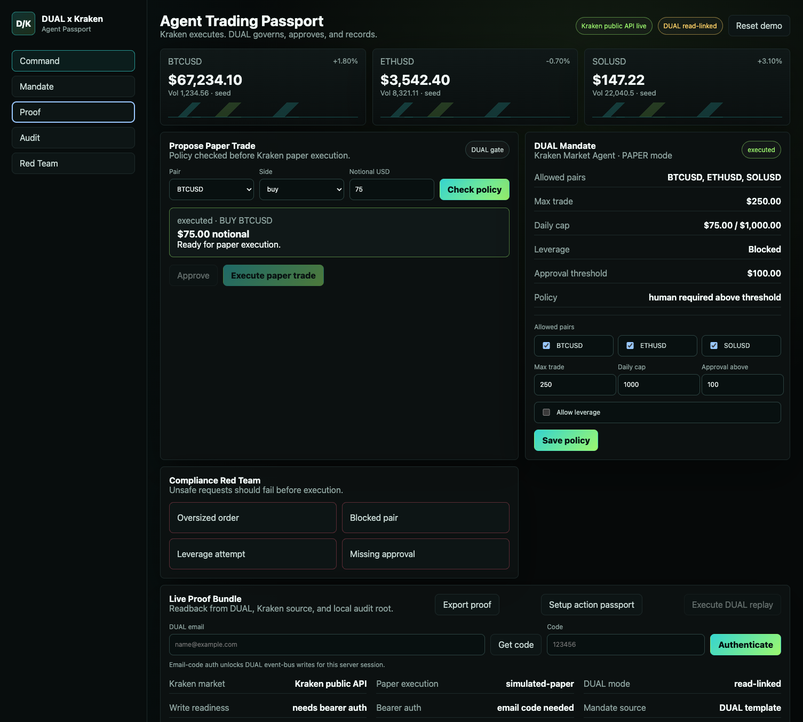
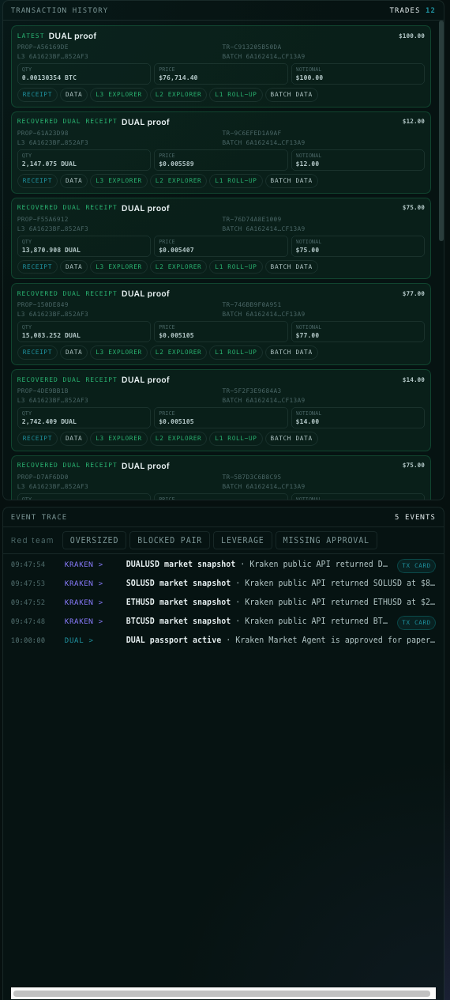
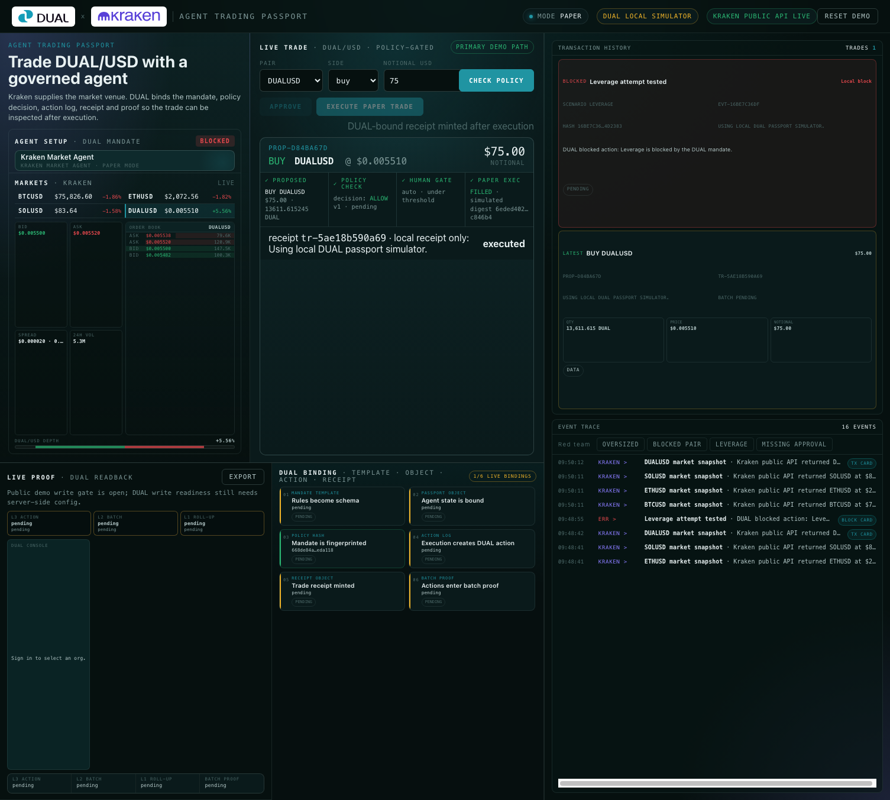

# Kraken DUAL Agent Demo Playbook

Live app: <https://kraken-dual-agent-demo.vercel.app/>

This playbook explains the demo as a presenter would run it: what to click, what the audience should notice, and what DUAL is proving at each point. It is written to support a 5-8 minute live walkthrough, a 2-minute compressed pitch, and a follow-up handout for technical reviewers.

## Executive Summary

The Kraken DUAL demo shows an AI market agent acting under a DUAL passport and mandate. The agent can propose a paper trade using Kraken public market data, but every action is checked against an explicit policy before it can execute. The app then produces a proof surface: agent identity, policy version, policy hash, DUAL object readback, DUAL batch evidence, and a local provenance timeline.

The key message is simple:

> DUAL turns agent execution from "the model did something" into "the agent acted inside a verifiable mandate, and the evidence is inspectable."

The demo is not about trading performance. It is about controlled agent action.

## Demo Assets

| Asset | Path |
| --- | --- |
| Live app | <https://kraken-dual-agent-demo.vercel.app/> |
| Playbook | `docs/kraken-dual-demo-playbook.md` |
| Screenshot 1 | `docs/assets/demo-playbook/01-command-trade-executed.png` |
| Screenshot 2 | `docs/assets/demo-playbook/02-proof-bundle.png` |
| Screenshot 3 | `docs/assets/demo-playbook/03-provenance-timeline.png` |
| Screenshot 4 | `docs/assets/demo-playbook/04-red-team-block.png` |

## Demo Thesis

The app shows an AI trading agent that can propose and execute paper trades against Kraken market data, while DUAL supplies the governance layer:

- A passported agent identity.
- A policy mandate that constrains what the agent may do.
- A proof bundle that links market data, policy state, DUAL readback, batch evidence, and local audit events.
- A red-team surface that shows unsafe requests being blocked before execution.

The demo is intentionally paper-only. No credentials and no real funds are used.

## Who This Demo Is For

| Audience | What they should take away |
| --- | --- |
| DUAL product team | The event-bus auth gap is now isolated and visible; the app otherwise shows a coherent end-to-end agent governance story. |
| Developers | DUAL can be integrated as a control plane around an existing app without exposing exchange credentials or secrets to the browser. |
| Enterprise / government buyers | Agent actions can be scoped, checked, blocked, and explained with a proof trail. |
| Crypto / token audiences | The agent passport and mandate behave like programmable authority objects, not just UI settings. |
| AI-agent builders | This is a pattern for giving agents bounded authority without relying on chat prompts as the enforcement layer. |

## Current State To Say Up Front

The demo is strong on DUAL readback, policy proof, passport state, per-trade receipt records, batch proof, and audit evidence. The event-bus write path uses the current `/ebus/execute` endpoint with scoped API-key auth via `x-api-key`; the endpoint no longer needs a DUAL bearer token.

Presenter line:

> "This is a full governance and proof demo. With the current DUAL action endpoint, scoped API-key auth can now be used for unattended server-side event-bus writes."

## System Map

What this means:

- Kraken supplies the market context.
- The app proposes a trade.
- DUAL supplies the agent identity and mandate proof surface.
- The local policy evaluator blocks or allows action based on the DUAL-linked mandate.
- The proof panel shows whether the app state is consistent with DUAL readback and batch evidence.
- Event-bus writes use the current `/ebus/execute` path with scoped API-key auth.
- Successful paper executions create deterministic trade receipts that can be minted one-per-trade into DUAL when the receipt template is configured.

## Recommended Timing

| Segment | Time | Purpose |
| --- | ---: | --- |
| Open and frame | 45 sec | Establish that this is paper-only and governance-focused. |
| Safe trade | 90 sec | Show a normal agent action passing policy. |
| Mandate | 60 sec | Show the policy boundary as editable and explicit. |
| Proof | 90 sec | Prove this is DUAL-linked, not a mock claim. |
| Audit | 45 sec | Show the traceable action path. |
| Red team | 90 sec | Show the blocked-action punchline. |
| Close | 30 sec | Tie the demo back to verifiable agent execution. |

Total: roughly 6-7 minutes.

## Two-Minute Version

Use this if the audience is impatient or already understands DUAL.

1. Open the app and point to `PAPER`, `Kraken public API live`, and `DUAL read-linked`.
2. Click **Check policy** on the default `BTCUSD` `$75` proposal.
3. Click **Execute paper trade** and show daily usage changing.
4. Open **Proof** and point to the DUAL object, policy hash, batch proof, and verifier.
5. Open **Red Team** and click **Oversized order**.
6. Close with: "The successful action matters, but the blocked action is the proof that the agent is operating inside a mandate."

## 1. Open The App

Start at the live app. Point out the first-viewport signals:

- `PAPER` mode in the sidebar.
- "No credentials. No real funds."
- `Kraken public API live`.
- `DUAL read-linked`.

The top of the app is the command surface. It shows the market, the trade proposal, the DUAL mandate, and the red-team controls together.

Screenshot readout:

- Left sidebar: the app is clearly in `PAPER` mode.
- Header: the agent is presented as a trading passport, not a generic chatbot.
- Market card: Kraken data is the venue context.
- Proposal card: the agent action is explicit and measurable.
- DUAL mandate card: the policy is visible next to the action.
- Timeline: execution leaves a trace.

Presenter line:

> "Kraken is the execution venue. DUAL is the control plane. The agent can see market data and propose an action, but the policy decides whether the action can proceed."

## 2. Create A Safe Paper Trade

Use the default trade:

- Pair: `BTCUSD`
- Side: `buy`
- Notional: `$75`

Click **Check policy**.

The policy allows the proposal because:

- `BTCUSD` is an allowed pair.
- `$75` is below the `$250` max trade size.
- `$75` is below the `$100` human approval threshold.
- Leverage is not requested.

Then click **Execute paper trade**.

What changes:

- Proposal state moves to `executed`.
- Daily usage moves from `$0.00` to `$75.00 / $1,000.00`.
- The provenance timeline records the proposal and execution.

Presenter line:

> "The agent did not just place a trade. It passed through a mandate first, and that decision is recorded."

What this proves:

- The app separates proposal from execution.
- A policy decision happens before action.
- The action can be represented as an auditable event.
- The trade is paper-only, so the demo is safe to run in front of any audience.

What not to over-claim:

- This is not a live Kraken trading bot.
- The market data is live/public, but execution is simulated.
- The demo does not claim agent alpha, portfolio performance, or investment advice.

## 3. Explain The DUAL Mandate

The mandate is the agent's operating boundary.

In this demo it contains:

- Allowed pairs: `BTCUSD`, `ETHUSD`, `SOLUSD`
- Max trade: `$250`
- Daily cap: `$1,000`
- Approval threshold: `$100`
- Leverage: blocked
- Policy: human required above threshold

The mandate is editable in the app so the audience can see that governance is not just a static label. It is active policy.

Presenter line:

> "The agent passport is not just identity. It carries an active mandate. Change the mandate and the agent's allowed behavior changes."

Technical interpretation:

| Mandate field | Demo meaning |
| --- | --- |
| Allowed pairs | Which markets the agent is allowed to touch. |
| Max trade | Hard cap per action. |
| Daily cap | Session-level budget boundary. |
| Approval threshold | Point where human approval is required. |
| Leverage | High-risk behavior gate. |
| Policy version/hash | Stable identity for the active policy. |

Buyer interpretation:

> "This is where an organization expresses what an agent is allowed to do before it ever touches an external system."

## 4. Show The Proof Bundle

Click **Proof**.

The proof panel is the credibility layer. It shows what the app can prove, not just what it claims.

Call out these rows:

- `Kraken market`: market source is Kraken public API.
- `Paper execution`: execution is simulated paper trading.
- `DUAL mode`: `write-sync` when production DUAL write readiness is active, otherwise `read-linked`.
- `Write readiness`: ready when `canWriteNow=true`; the flattened reason explains whether the blocker is DUAL write config or public demo writes being disabled.
- `Write gate`: public demo writes are enabled by default and can be disabled with `DEMO_PUBLIC_DUAL_WRITES=false` for a read-linked rehearsal.
- `Mandate source`: DUAL template.
- `DUAL object`: passport object used by the demo.
- DUAL data links: open explicit DUAL record readback for the passport template, passport object, latest batch, latest affected actions, receipt template/object when present, and a Blockscout transaction when a finalized batch hash is available. Console detail links are opt-in because the current Console entity routes can 404.
- Public browser and MCP trades create DUAL action logs when server-side write readiness is active. For Console-visible receipt objects, configure or create the DUAL trade receipt template before minting receipts.
- `Policy version` and `Policy hash`: stable policy identity.
- `DUAL batch` and `Batch proof`: DUAL batch evidence is present.
- `Verifier`: all checks pass.

Presenter line:

> "This panel is the trust receipt. It ties the app state back to DUAL object readback, policy hash, batch evidence, and the local audit root."

Proof interpretation:

| Proof row | Why it matters |
| --- | --- |
| Kraken market | Shows the app is not inventing a market source. |
| Paper execution | Makes the demo safe and honest. |
| DUAL mode | Shows whether DUAL is read-linked or write-synced. |
| Write readiness | Shows whether unattended write credentials are available. |
| Write auth | Makes the scoped API-key write-readiness dependency explicit. |
| Mandate source | Ties the agent to a DUAL template. |
| DUAL object | Ties the app to a specific agent passport object. |
| DUAL links | Lets the presenter leave the app and inspect the exact DUAL Console template, object, action, or Blockscout transaction. |
| Policy hash | Makes the current mandate fingerprintable. |
| DUAL batch | Shows DUAL batch evidence is being read. |
| Batch proof | Shows the DUAL-side proof state visible to the app. |
| Verifier | Collapses the proof checks into a clear pass/fail signal. |

If challenged on whether this is "really DUAL":

> "The app is not just displaying DUAL branding. It reads the passport object, mandate data, and batch evidence back from DUAL, then uses those values in the proof verifier."

Email/code authentication is not part of the main demo path. The production posture is scoped API-key auth for DUAL event-bus writes; email-code auth is only an opt-in fallback for private browser sessions.

## 5. Show The Audit Trail

Click **Audit**.

The timeline explains the event sequence in human terms.

Expected sequence after a safe run:

1. DUAL passport active.
2. Trade proposal created.
3. Kraken paper trade executed.

Each event carries a short hash so the story is not just UI state. It is a traceable sequence.

Presenter line:

> "The user can see not only the final state, but the path the agent took to get there."

What the audit trail is doing:

- It explains the action sequence in human-readable form.
- It keeps proof hashes visible without forcing the user into raw JSON.
- It gives the presenter a story: passport active, proposal checked, execution recorded, unsafe request blocked.

What to say if asked about production audit durability:

> "The demo already models the evidence chain. Durable unattended DUAL event-bus writes now use the current `/ebus/execute` path with a scoped API key. Each executed paper trade also receives a deterministic receipt that can be minted as its own DUAL object."

## 6. Run A Red-Team Check

Click **Red Team**, then click **Oversized order**.

The app should block the request because it exceeds the per-trade cap.

What to point out:

- The mandate status changes to `blocked`.
- The unsafe request does not execute.
- The timeline records the blocked attempt.
- The reason is explicit: the notional exceeds the per-trade cap.

Presenter line:

> "The most important demo moment is not the successful trade. It is the blocked trade. DUAL makes the agent's boundaries visible and enforceable."

Why this is the punchline:

- Successful agent demos are easy to fake.
- Blocked behavior proves the control layer exists.
- The blocked reason is explainable.
- The attempted action becomes part of the story rather than disappearing.

Other red-team checks available in the app:

| Check | Expected meaning |
| --- | --- |
| Oversized order | Per-trade cap blocks the action. |
| Blocked pair | Market allowlist blocks the action. |
| Leverage attempt | Leverage policy blocks the action. |
| Missing approval | Approval threshold requires human intervention. |

## 7. Explain What DUAL Is Reading And Writing

Current read/proof path:

- Reads the DUAL agent passport object.
- Reads the DUAL policy state through passport custom data.
- Reads DUAL batch proof evidence.
- Reads DUAL-linked identifiers used by the verifier.

Live write path:

- Policy updates are prepared as DUAL object updates.
- Audit/provenance events are prepared as event-bus envelopes.
- Replay execution runs when scoped API-key write auth is available; queued envelopes remain visible if write readiness is unavailable.

Important distinction:

> Current DUAL testnet writes use `/ebus/execute` with scoped API-key auth via `x-api-key`. The demo does not use a separate browser/MCP auth gate.

For MCP demos, no MCP authentication is required. When write readiness is active, trade tools anchor proposal/execution evidence to DUAL automatically. If write readiness is unavailable, trade tool responses include top-level warnings and the trade receipt stays local-only.

Detailed read/write map:

| Surface | Direction | Current status | Demo role |
| --- | --- | --- | --- |
| Agent passport object | Read | Working | Establishes the DUAL-linked agent identity. |
| Mandate custom data | Read | Working | Provides policy state and policy hash. |
| Template metadata | Read | Working | Shows the passport comes from a DUAL template. |
| Sequencer batch evidence | Read | Working | Provides DUAL batch proof context. |
| Policy updates | Write-capable | App support present | Can update passport custom data when scoped API-key write auth is ready. |
| Event-bus action envelopes | Write-capable | App support present | Ready to emit provenance/action events through `/ebus/execute`. |
| Trade receipt mints | Write-capable | App support present | Ready to mint one DUAL receipt object per executed paper trade when `DUAL_TRADE_RECEIPT_TEMPLATE_ID` is set. |
| Replay queue | Local pending/synced state | Working | Keeps pending writes visible instead of hiding auth failure. |

Plain-English explanation:

> "The app can read from DUAL, prove what it read, and write event-bus actions when deployed with `DUAL_WRITE_MODE=event_bus` and a scoped write-capable API key."

## 8. Demo Architecture Narrative

Use this explanation for technical reviewers:

1. The browser loads the trading cockpit.
2. Server-side app code fetches public market context from Kraken.
3. The app reads the DUAL passport and mandate state.
4. A user or agent proposes an action.
5. The app checks the proposal against the mandate.
6. If allowed, the app performs a paper execution and records provenance.
7. If blocked, the app records the blocked attempt and reason.
8. The proof endpoint verifies that the visible state matches DUAL-linked evidence.
9. DUAL event-bus writes run through `/ebus/execute` when scoped API-key write auth is available.
10. Executed paper trades produce deterministic trade receipts and can mint those receipts as individual DUAL objects.

## 9. Objection Handling

| Question | Answer |
| --- | --- |
| Is this using real Kraken funds? | No. It uses Kraken public market data and paper execution. That is intentional for demo safety. |
| Is this just a mock UI? | No. The proof panel reads DUAL-linked object, mandate, and batch evidence. Execution is paper, but the governance/proof path is real. |
| Why does it say `read-linked`? | Because this deployment has not enabled `DUAL_WRITE_MODE=event_bus` or does not have a write-capable key installed. |
| Why use an API key now? | Current DUAL testnet event-bus writes use `/ebus/execute` with scoped API-key auth via `x-api-key`; the endpoint no longer needs a bearer token. |
| What is the user benefit? | Agent actions become bounded, explainable, and auditable instead of being opaque calls from a model to a tool. |
| What is the developer benefit? | The policy and proof layer can sit around an app without putting exchange credentials in the browser. |
| What is the DUAL platform feedback? | Provide a least-privilege service credential or service-session path accepted by event-bus write endpoints. |

## 10. Troubleshooting During A Live Demo

| Symptom | What to do |
| --- | --- |
| Market card is slow or stale | Continue. The demo thesis does not depend on the exact live price. |
| Policy check does not change state immediately | Click once, wait for the proposal status, then narrate the policy rules. |
| Proof shows `read-linked` | Check that `DUAL_WRITE_MODE=event_bus`, `DUAL_API_URL=https://api-testnet.dual.network`, `DUAL_EVENTBUS_WRITE_PATH=/ebus/execute`, a scoped API key, and `DEMO_PUBLIC_DUAL_WRITES=true` or unset are configured. |
| Batch proof is not finalized | Say the demo reads DUAL batch evidence, and the current state may be anchoring rather than finalized. |
| Red-team block has old timeline entries | Focus on the newest blocked event and the explicit reason. |
| Audience asks for real trading | Reframe: the demo is about agent governance and proof, not financial execution. |

## 11. Score And Remaining Gap

Current DUAL demo score: `9.4/10` as a public demo. It reaches the 9.8 target once the DUAL trade receipt template is live in production and a receipt replay is verified against DUAL readback.

Why it is high:

- DUAL passport object is linked.
- DUAL mandate is visible and operational.
- Policy checks gate actions before execution.
- Proof bundle is understandable to non-developers.
- DUAL batch evidence is surfaced.
- Red-team scenarios demonstrate enforcement, not just happy-path action.

Remaining `0.3`:

- Production needs a scoped event-bus API key installed in Vercel with `DUAL_WRITE_MODE=event_bus`.
- The app should move from `read-linked` to durable `write-synced` using the current `/ebus/execute` path.
- Per-trade receipt minting should be shown after `DUAL_TRADE_RECEIPT_TEMPLATE_ID` is configured.
- Finalized L1 proof status should be shown as a first-class row once available, distinct from anchoring/proof-success batch state.

## 12. Close The Demo

Close with the value proposition:

> "This is what DUAL adds to AI-agent execution: an agent passport, explicit mandate, policy-gated action, proof, and an audit trail. The agent does not just act. It acts within a verifiable boundary."

Short close:

> "This is the control layer for useful agents: identity, mandate, action, proof."

Long close:

> "The market data and paper trade make the demo concrete, but the real product is the governance pattern. A user can see what the agent was allowed to do, what it actually did, why unsafe actions were blocked, and what evidence backs that up."

## Presenter Checklist

- Open the live app.
- Confirm `PAPER` mode and no real funds.
- Run default `BTCUSD` `$75` policy check.
- Execute the paper trade.
- Show mandate usage moved to `$75 / $1,000`.
- Open Proof and call out policy hash, DUAL object, batch proof, verifier.
- Open Audit and show proposal plus execution.
- Run Red Team oversized order.
- Explain that write-sync depends on the current DUAL `/ebus/execute` API-key path being configured in production.

## Post-Demo Follow-Up

Send these points after the demo:

- Live demo URL: <https://kraken-dual-agent-demo.vercel.app/>
- The app is paper-only and uses no real funds.
- DUAL readback and proof surfaces are live.
- The remaining deployment ask is a least-privilege API key accepted by the DUAL `/ebus/execute` write endpoint plus a configured DUAL trade receipt template.
- The reusable pattern is agent passport plus mandate plus proof, not trading-specific logic.

## One-Page Recap

The Kraken DUAL demo is a concrete example of governed AI-agent execution. The agent proposes a trade using live Kraken public market data. DUAL supplies the agent passport and mandate. The app checks the proposed action against allowed pairs, trade limits, daily limits, approval thresholds, and leverage rules. Safe paper trades can proceed; unsafe requests are blocked and explained.

The proof bundle turns the demo from a UI into an evidence story. It shows the DUAL object, policy hash, mandate source, batch proof, and verifier state. The audit trail shows the sequence of events. The red-team controls show that boundaries are enforceable.

The remaining deployment gap is installing a scoped API key, enabling `DUAL_WRITE_MODE=event_bus` against `https://api-testnet.dual.network/ebus/execute`, and setting `DUAL_TRADE_RECEIPT_TEMPLATE_ID`. Once configured, the demo can move from `read-linked` to fully `write-synced` with one DUAL receipt object per executed paper trade.
