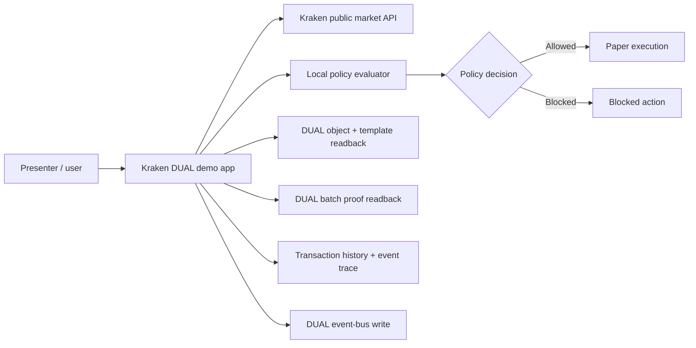

# Kraken DUAL Agent Demo Playbook

Live app: <https://kraken-dual-agent-demo.vercel.app/>

This playbook explains the demo as a presenter would run it: what to click, what the audience should notice, and what DUAL is proving at each point. It is written to support a 5-8 minute live walkthrough, a 2-minute compressed pitch, and a follow-up handout for technical reviewers.

## Executive Summary

The Kraken DUAL demo shows an AI market agent acting under a DUAL passport and mandate. The agent can propose a paper trade using Kraken public market data, but every action is checked against an explicit policy before it can execute. The app now puts the whole evidence story on the first viewport: agent identity, policy version, policy hash, DUAL readback, DUAL batch evidence, transaction history, and event trace.

The key message is simple:

> DUAL turns agent execution from "the model did something" into "the agent acted inside a verifiable mandate, and the evidence is inspectable."

The demo is not about trading performance. It is about controlled agent action.

## Demo Assets

| Asset | Path |
| --- | --- |
| Live app | <https://kraken-dual-agent-demo.vercel.app/> |
| Playbook | `docs/kraken-dual-demo-playbook.md` |
| L3/L2/L1 run sheet | `docs/kraken-dual-l3-l2-l1-demo-run-sheet.md` |
| Screenshot 1: current trade cockpit | `docs/assets/demo-playbook/01-command-trade-executed.png` |
| Screenshot 2: live proof + DUAL binding | `docs/assets/demo-playbook/02-proof-bundle.png` |
| Screenshot 3: transaction history + event trace | `docs/assets/demo-playbook/03-provenance-timeline.png` |
| Screenshot 4: blocked red-team action | `docs/assets/demo-playbook/04-red-team-block.png` |

## Demo Thesis

The app shows an AI trading agent that can propose and execute paper trades against Kraken market data, while DUAL supplies the governance layer:

- A passported agent identity.
- A policy mandate that constrains what the agent may do.
- A proof bundle that links market data, policy state, DUAL readback, batch evidence, transaction history, and event-trace evidence.
- A red-team surface that shows unsafe requests being blocked before execution.

The demo is intentionally paper-only. No credentials and no real funds are used.

## Who This Demo Is For

| Audience | What they should take away |
| --- | --- |
| DUAL product team | The app now shows write/readback readiness, receipt history, DUAL binding, and blocked policy proof on one surface. |
| Developers | DUAL can be integrated as a control plane around an existing app without exposing exchange credentials or secrets to the browser. |
| Enterprise / government buyers | Agent actions can be scoped, checked, blocked, and explained with a proof trail. |
| Crypto / token audiences | The agent passport and mandate behave like programmable authority objects, not just UI settings. |
| AI-agent builders | This is a pattern for giving agents bounded authority without relying on chat prompts as the enforcement layer. |

## Current State To Say Up Front

The demo is strong on DUAL readback, policy proof, passport state, per-trade receipt records, batch proof, transaction history, and blocked-action evidence. The event-bus write path uses the current `/ebus/execute` endpoint with scoped API-key auth via `x-api-key`; the endpoint no longer needs a DUAL bearer token. In local rehearsal mode, the same UI can run against a local simulator so the presenter can capture or rehearse without creating new DUAL writes.

Presenter line:

> "This is a full governance and proof demo. Kraken provides the market context; DUAL supplies the mandate, write/readback evidence, receipt history, and proof surface."

## System Map

What this means:

- Kraken supplies the market context.
- The app proposes a trade.
- DUAL supplies the agent identity and mandate proof surface.
- The local policy evaluator blocks or allows action based on the DUAL-linked mandate.
- The first-viewport proof surfaces show whether the app state is consistent with DUAL readback, receipt history, and batch evidence.
- Event-bus writes use the current `/ebus/execute` path with scoped API-key auth.
- Successful paper executions create deterministic trade receipts that can be minted one-per-trade into DUAL when the receipt template is configured.

## Recommended Timing

| Segment | Time | Purpose |
| --- | ---: | --- |
| Open and frame | 45 sec | Establish that this is paper-only and governance-focused. |
| Safe trade | 90 sec | Show a normal agent action passing policy. |
| Mandate | 60 sec | Show the policy boundary as editable and explicit. |
| Proof | 90 sec | Prove this is DUAL-linked, not a mock claim. |
| Trace | 45 sec | Show the transaction history and event trace. |
| Red team | 90 sec | Show the blocked-action punchline. |
| Close | 30 sec | Tie the demo back to verifiable agent execution. |

Total: roughly 6-7 minutes.

## Two-Minute Version

Use this if the audience is impatient or already understands DUAL.

1. Open the app and point to `MODE PAPER`, `KRAKEN PUBLIC API LIVE`, and the DUAL status chip.
2. Click **Check policy** on the default `DUALUSD` `$75` proposal.
3. Click **Execute paper trade** and show daily usage changing.
4. Point to **LIVE PROOF** and **DUAL BINDING**: policy hash, action log, receipt object, and batch proof.
5. Use the red-team buttons in **EVENT TRACE** and trigger an oversized, blocked-pair, leverage, or missing-approval action.
6. Close with: "The successful action matters, but the blocked action is the proof that the agent is operating inside a mandate."

## 1. Open The App

Start at the live app. Point out the first-viewport signals:

- `MODE PAPER`.
- "No credentials. No real funds."
- `KRAKEN PUBLIC API LIVE`.
- The DUAL status chip: `DUAL WRITE-SYNC LIVE` in production, or `DUAL LOCAL SIMULATOR` during safe local rehearsal.

The app is now designed as one cockpit. The first viewport shows the market, live trade controls, transaction history, event trace, live proof, and DUAL binding together.

Screenshot readout:

- Header chips: `MODE PAPER`, DUAL mode, and Kraken public API status are visible before any action.
- Left rail: the agent is presented as a trading passport, not a generic chatbot.
- Center: `LIVE TRADE` shows the explicit proposal, policy result, human gate, and paper execution state.
- Right rail: `TRANSACTION HISTORY` and `EVENT TRACE` show the action path without opening a secondary panel.
- Bottom row: `LIVE PROOF` and `DUAL BINDING` show readback, policy hash, action log, receipt object, and batch proof.

Presenter line:

> "Kraken is the execution venue. DUAL is the control plane. The agent can see market data and propose an action, but the policy decides whether the action can proceed."

## 2. Create A Safe Paper Trade

Use the default trade:

- Pair: `DUALUSD`
- Side: `buy`
- Notional: `$75`

Click **Check policy**.

The policy allows the proposal because:

- `DUALUSD` is an allowed pair.
- `$75` is below the `$250` max trade size.
- `$75` is below the `$100` human approval threshold.
- Leverage is not requested.

Then click **Execute paper trade**.

What changes:

- Proposal state moves to `executed`.
- Daily usage moves from `$0.00` to `$75.00 / $1,000.00`.
- `TRANSACTION HISTORY` receives a new receipt card.
- `EVENT TRACE` records the proposal, policy decision, and execution.
- `LIVE PROOF` and `DUAL BINDING` update to show the proof state. In local mode this stays as local simulator evidence; in production it shows the write/readback path.

Presenter line:

> "The agent did not just place a trade. It passed through a mandate first, and that decision is recorded."

What this proves:

- The app separates proposal from execution.
- A policy decision happens before action.
- The action can be represented as an auditable event.
- The trade is paper-only, so the demo is safe to run in front of any audience.

What not to over-claim:

- This is not a live Kraken trading bot.
- The market data is live/public, but execution is simulated.
- The demo does not claim agent alpha, portfolio performance, or investment advice.

## 3. Explain The DUAL Mandate

The mandate is the agent's operating boundary.

In this demo it contains:

- Allowed pairs: `DUALUSD`, `BTCUSD`, `ETHUSD`, `SOLUSD`
- Max trade: `$250`
- Daily cap: `$1,000`
- Approval threshold: `$100`
- Leverage: blocked
- Policy: human required above threshold

The mandate is editable in the app so the audience can see that governance is not just a static label. It is active policy.

Presenter line:

> "The agent passport is not just identity. It carries an active mandate. Change the mandate and the agent's allowed behavior changes."

Technical interpretation:

| Mandate field | Demo meaning |
| --- | --- |
| Allowed pairs | Which markets the agent is allowed to touch. |
| Max trade | Hard cap per action. |
| Daily cap | Session-level budget boundary. |
| Approval threshold | Point where human approval is required. |
| Leverage | High-risk behavior gate. |
| Policy version/hash | Stable identity for the active policy. |

Buyer interpretation:

> "This is where an organization expresses what an agent is allowed to do before it ever touches an external system."

## 4. Show The Proof Bundle

Use the lower row: **LIVE PROOF** on the left and **DUAL BINDING** in the middle. No separate proof modal is required.

This is the credibility layer. It shows what the app can prove, not just what it claims.

Call out these surfaces:

- `LIVE PROOF`: DUAL readback status, L3 action, L2 batch, L1 roll-up, DUAL Console link, and verified data links.
- `DUAL BINDING`: six live bindings across mandate template, passport object, policy hash, action log, receipt object, and batch proof.
- `Policy hash`: the active mandate is fingerprinted, not just described.
- `Action log`: execution creates a DUAL action when write-sync is active.
- `Receipt object`: each executed paper trade can be represented as its own receipt object when the template is configured.
- `Batch proof`: actions enter the batch proof path and can be inspected through L2/L1 links when available.
- `Data` links: open the app's verified DUAL readback route for the same template, object, batch, action, or receipt.

Presenter line:

> "This is the trust receipt. It ties the app state back to DUAL object readback, policy hash, action evidence, receipt state, and batch proof."

Proof interpretation:

| Proof row | Why it matters |
| --- | --- |
| LIVE PROOF | Shows whether DUAL readback, L3 action, L2 batch, and L1 roll-up evidence are available. |
| DUAL Console | Lets the presenter leave the app and inspect the org or entity context. |
| Passport object | Ties the app to a specific DUAL-backed agent identity. |
| Mandate template | Shows the agent is governed by a reusable DUAL rules object. |
| Policy hash | Makes the current mandate fingerprintable. |
| Action log | Shows that execution can create a DUAL action record. |
| Receipt object | Shows the trade can become a durable DUAL receipt, not just a UI row. |
| Batch proof | Shows the action entering the proof pipeline. |
| L3/L2/L1 links | Show the path from DUAL action to batch and roll-up evidence when available. |

If challenged on whether this is "really DUAL":

> "The app is not just displaying DUAL branding. It reads the passport object, mandate data, action evidence, and batch evidence back from DUAL, then surfaces those values in the verifier and binding cards."

Email/code authentication is not part of the main demo path. The production posture is scoped API-key auth for DUAL event-bus writes; email-code auth is only an opt-in fallback for private browser sessions.

## 5. Show Transaction History And Event Trace

Use the right rail. `TRANSACTION HISTORY` shows trade and block records; `EVENT TRACE` shows the underlying event sequence in human terms.

Expected sequence after a safe run:

1. DUAL passport active.
2. Kraken market snapshots load.
3. Trade proposal is checked.
4. Paper execution creates a receipt card.
5. DUAL action, receipt, batch, and roll-up links appear when write/readback evidence is available.

Each record carries ids, hashes, or linked evidence so the story is not just UI state. It is a traceable sequence.

Presenter line:

> "The user can see not only the final state, but the path the agent took to get there."

What the right rail is doing:

- It explains the action sequence in human-readable form.
- It keeps proof hashes, receipt ids, and DUAL links visible without forcing the user into raw JSON.
- It gives the presenter a story: passport active, proposal checked, execution recorded, unsafe request blocked.
- It makes blocked actions first-class proof records, not hidden error states.

What to say if asked about production audit durability:

> "The demo already models the evidence chain. Durable unattended DUAL event-bus writes use the current `/ebus/execute` path with a scoped API key. Each executed paper trade receives a deterministic receipt, and production write-sync can anchor that evidence into DUAL."

## 6. Run A Red-Team Check

Use the red-team buttons inside **EVENT TRACE**. Trigger **Oversized**, **Blocked pair**, **Leverage**, or **Missing approval**.

The app should block the request before execution. The screenshot below uses a leverage-style blocked action.

What to point out:

- The mandate status changes to `blocked`.
- The unsafe request does not execute.
- `TRANSACTION HISTORY` gets a red block card above the latest successful trade.
- `EVENT TRACE` gets an `ERR` row with a `BLOCK CARD` link.
- The reason is explicit: per-trade cap, pair allowlist, leverage block, or missing approval.

Presenter line:

> "The most important demo moment is not the successful trade. It is the blocked trade. DUAL makes the agent's boundaries visible and enforceable."

Why this is the punchline:

- Successful agent demos are easy to fake.
- Blocked behavior proves the control layer exists.
- The blocked reason is explainable.
- The attempted action becomes part of the story rather than disappearing.

Other red-team checks available in the app:

| Check | Expected meaning |
| --- | --- |
| Oversized order | Per-trade cap blocks the action. |
| Blocked pair | Market allowlist blocks the action. |
| Leverage attempt | Leverage policy blocks the action. |
| Missing approval | Approval threshold requires human intervention. |

## 7. Explain What DUAL Is Reading And Writing

Current read/proof path:

- Reads the DUAL agent passport object.
- Reads the DUAL policy state through passport custom data.
- Reads DUAL batch proof evidence.
- Reads DUAL-linked identifiers used by the verifier.
- Reads back transaction, action, receipt, and batch identifiers into the proof surfaces when available.

Live write path:

- Policy updates are prepared as DUAL object updates.
- Action and provenance events are prepared as event-bus envelopes.
- Replay execution runs when scoped API-key write auth is available; queued envelopes remain visible if write readiness is unavailable.

Important distinction:

> Current DUAL testnet writes use `/ebus/execute` with scoped API-key auth via `x-api-key`. The demo does not use a separate browser/MCP auth gate.

For MCP demos, no MCP authentication is required. When write readiness is active, trade tools anchor proposal/execution evidence to DUAL automatically. If write readiness is unavailable, trade tool responses include top-level warnings and the trade receipt stays local-only.

Detailed read/write map:

| Surface | Direction | Current status | Demo role |
| --- | --- | --- | --- |
| Agent passport object | Read | Working | Establishes the DUAL-linked agent identity. |
| Mandate custom data | Read | Working | Provides policy state and policy hash. |
| Template metadata | Read | Working | Shows the passport comes from a DUAL template. |
| Sequencer batch evidence | Read | Working | Provides DUAL batch proof context. |
| Policy updates | Write-capable | App support present | Can update passport custom data when scoped API-key write auth is ready. |
| Event-bus action envelopes | Write-capable | App support present | Ready to emit provenance/action events through `/ebus/execute`. |
| Trade receipt mints | Write-capable | App support present | Ready to mint one DUAL receipt object per executed paper trade when `DUAL_TRADE_RECEIPT_TEMPLATE_ID` is set. |
| Replay queue | Local pending/synced state | Working | Keeps pending writes visible instead of hiding auth failure. |

Plain-English explanation:

> "The app can read from DUAL, prove what it read, and write event-bus actions when deployed with `DUAL_WRITE_MODE=event_bus` and a scoped write-capable API key."

## 8. Demo Architecture Narrative

Use this explanation for technical reviewers:

1. The browser loads the trading cockpit.
2. Server-side app code fetches public market context from Kraken.
3. The app reads the DUAL passport and mandate state.
4. A user or agent proposes an action.
5. The app checks the proposal against the mandate.
6. If allowed, the app performs a paper execution and records provenance.
7. If blocked, the app records the blocked attempt and reason.
8. The proof endpoint verifies that the visible state matches DUAL-linked evidence.
9. DUAL event-bus writes run through `/ebus/execute` when scoped API-key write auth is available.
10. Executed paper trades produce deterministic trade receipts and can mint those receipts as individual DUAL objects.

## 9. Objection Handling

| Question | Answer |
| --- | --- |
| Is this using real Kraken funds? | No. It uses Kraken public market data and paper execution. That is intentional for demo safety. |
| Is this just a mock UI? | No. The proof surfaces read DUAL-linked object, mandate, action, receipt, and batch evidence. Execution is paper, but the governance/proof path is real. |
| Why does one screenshot say `DUAL LOCAL SIMULATOR`? | That screenshot was captured in local rehearsal mode to avoid creating new DUAL writes while documenting the app. Production uses the same UI with live DUAL write/readback when configured. |
| What if the DUAL status is pending or local? | Continue the demo. It still proves the mandate and blocked-action flow; call out that live write-sync depends on scoped server-side credentials. |
| Why use an API key now? | Current DUAL testnet event-bus writes use `/ebus/execute` with scoped API-key auth via `x-api-key`; the endpoint no longer needs a bearer token. |
| What is the user benefit? | Agent actions become bounded, explainable, and auditable instead of being opaque calls from a model to a tool. |
| What is the developer benefit? | The policy and proof layer can sit around an app without putting exchange credentials in the browser. |
| What is the DUAL platform feedback? | Make least-privilege service credentials, receipt templates, and receipt readback easy for developers to provision. |

## 10. Troubleshooting During A Live Demo

| Symptom | What to do |
| --- | --- |
| Market card is slow or stale | Continue. The demo thesis does not depend on the exact live price. |
| Policy check does not change state immediately | Click once, wait for the proposal status, then narrate the policy rules. |
| DUAL status shows local or pending | Explain that this is safe rehearsal mode, then point to the same proof/binding surfaces. For production write-sync, check `DUAL_WRITE_MODE=event_bus`, `DUAL_API_URL=https://api-testnet.dual.network`, `DUAL_EVENTBUS_WRITE_PATH=/ebus/execute`, a scoped API key, and `DEMO_PUBLIC_DUAL_WRITES=true` or unset. |
| Batch proof is not finalized | Say the demo reads DUAL batch evidence, and the current state may be anchoring rather than finalized. |
| Red-team block appears below other history | Focus on the red block card and the newest `ERR` row in `EVENT TRACE`. |
| Audience asks for real trading | Reframe: the demo is about agent governance and proof, not financial execution. |

## 11. Score And Remaining Gap

Current DUAL demo score: `9.7/10` as a public demo. It reaches the 9.8+ target once receipt-template provisioning and finalized L1 proof links are predictable enough for any presenter to run without pre-checking production state.

Why it is high:

- DUAL passport object is linked.
- DUAL mandate is visible and operational.
- Policy checks gate actions before execution.
- Proof bundle is understandable to non-developers.
- Transaction history and event trace are first-viewport surfaces.
- DUAL batch evidence is surfaced.
- Red-team scenarios demonstrate enforcement, not just happy-path action.

Remaining `0.3`:

- Receipt-template configuration should be obvious to a new operator.
- Per-trade receipt minting should be verified before any high-stakes live presentation.
- The live app shows the settlement path as `L3 action -> L2 batch -> L1 roll-up`. If a finalized L1 transaction hash is not present yet, call out whether the L1 roll-up is pending or represented through the L2 batch link.

## 12. Close The Demo

Close with the value proposition:

> "This is what DUAL adds to AI-agent execution: an agent passport, explicit mandate, policy-gated action, proof, and an audit trail. The agent does not just act. It acts within a verifiable boundary."

Short close:

> "This is the control layer for useful agents: identity, mandate, action, proof."

Long close:

> "The market data and paper trade make the demo concrete, but the real product is the governance pattern. A user can see what the agent was allowed to do, what it actually did, why unsafe actions were blocked, and what evidence backs that up."

## Presenter Checklist

- Open the live app.
- Confirm `PAPER` mode and no real funds.
- Confirm the top chips: DUAL mode and `KRAKEN PUBLIC API LIVE`.
- Run default `DUALUSD` `$75` policy check.
- Execute the paper trade.
- Show mandate usage moved to `$75 / $1,000`.
- Point to `TRANSACTION HISTORY` and show the new receipt card.
- Point to `LIVE PROOF` and `DUAL BINDING`: policy hash, passport object, action log, receipt object, batch proof.
- Use `EVENT TRACE` red-team buttons and trigger a blocked action.
- Explain that production write-sync uses the current DUAL `/ebus/execute` API-key path.

## Post-Demo Follow-Up

Send these points after the demo:

- Live demo URL: <https://kraken-dual-agent-demo.vercel.app/>
- The app is paper-only and uses no real funds.
- DUAL readback, proof, binding, transaction-history, and blocked-action surfaces are visible on the first viewport.
- The remaining operator ask is to confirm least-privilege API-key write readiness and the DUAL trade receipt template before a major live event.
- The reusable pattern is agent passport plus mandate plus proof, not trading-specific logic.

## One-Page Recap

The Kraken DUAL demo is a concrete example of governed AI-agent execution. The agent proposes a trade using live Kraken public market data. DUAL supplies the agent passport and mandate. The app checks the proposed action against allowed pairs, trade limits, daily limits, approval thresholds, and leverage rules. Safe paper trades can proceed; unsafe requests are blocked and explained.

The proof bundle turns the demo from a UI into an evidence story. It shows the DUAL object, policy hash, mandate source, action evidence, receipt state, batch proof, and verifier state. The transaction history and event trace show the sequence of events. The red-team controls show that boundaries are enforceable.

The remaining operating discipline is checking scoped API-key readiness, `DUAL_WRITE_MODE=event_bus`, and `DUAL_TRADE_RECEIPT_TEMPLATE_ID` before presenting. Once configured, the demo can run write-synced with one DUAL receipt object per executed paper trade.
